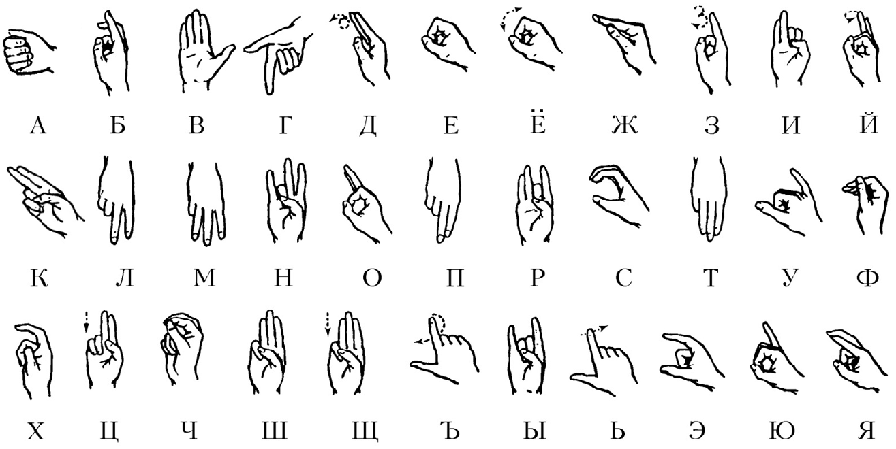
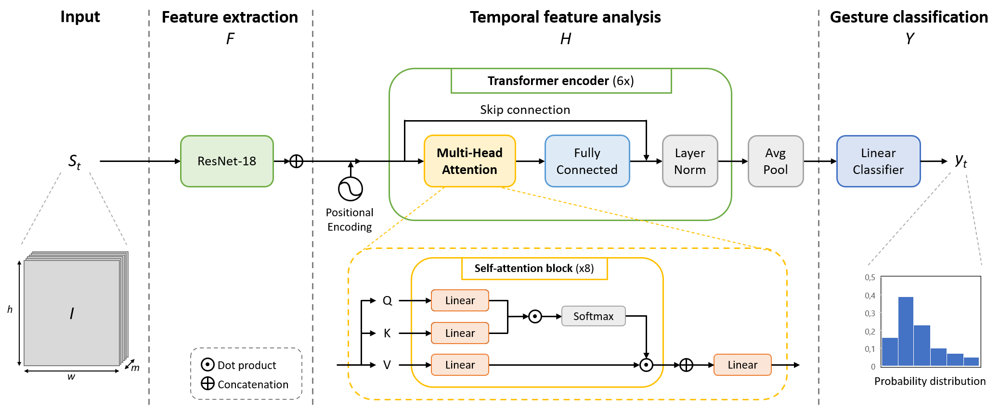
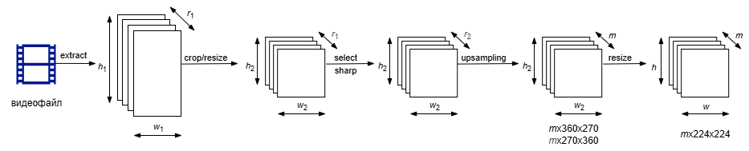
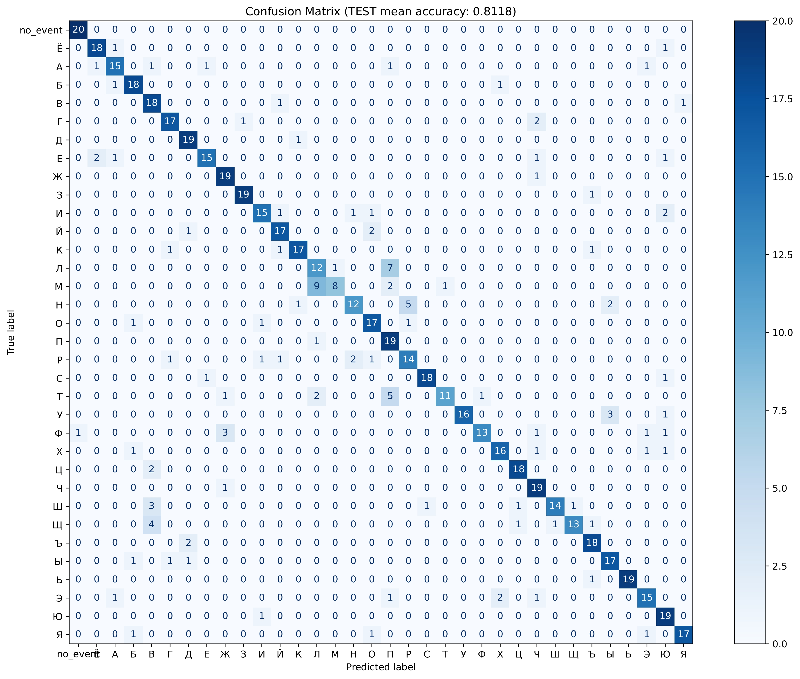
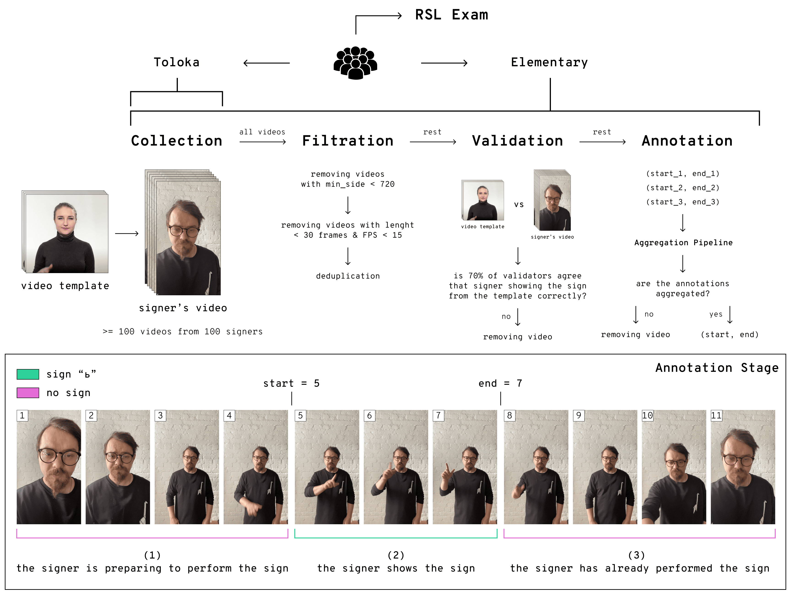
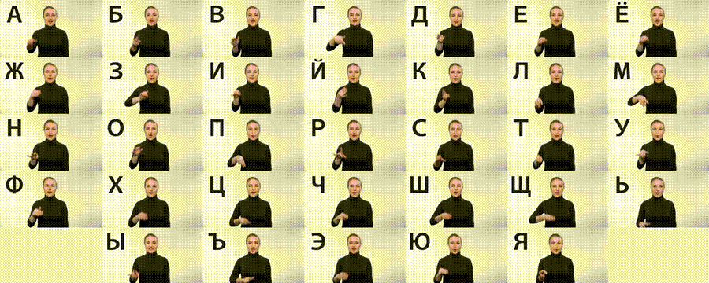
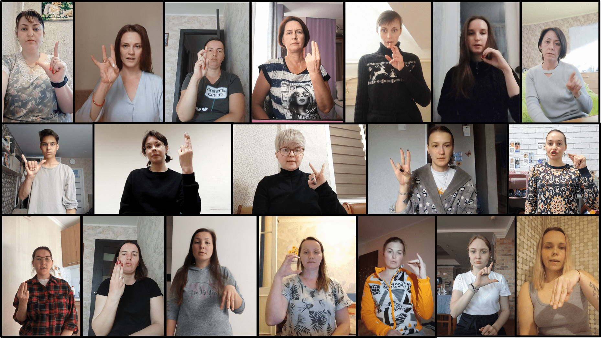
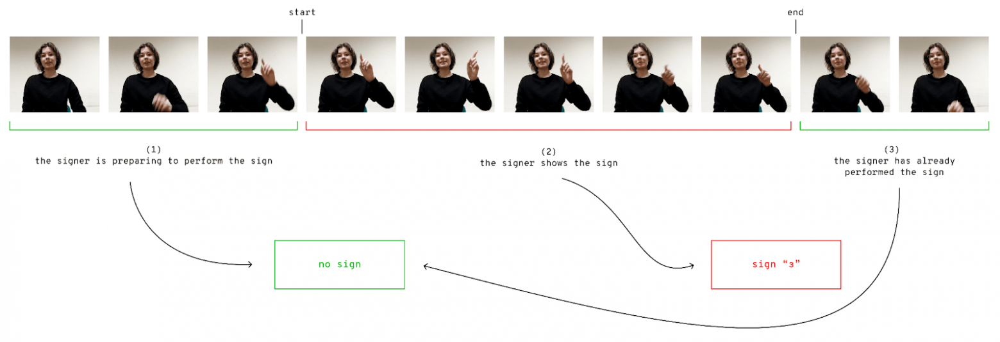

# Transformer-Based Dactile Language Gesture Recognition

Решена задача перевода (распознавания, классификации) изолированных жестов русского дактильного языка. Область применения - тренажеры алфавита языка жестов.



## Архитектура модели

В основу проекта положена архитектура, описанная в статье

*A. D’Eusanio, A. Simoni, S. Pini, G. Borghi, R. Vezzani, R. Cucchiara*  
**A Transformer-Based Network for Dynamic Hand Gesture Recognition**  
*In International Conference on 3D Vision (3DV) 2020.*

**[[Paper](https://iris.unimore.it/retrieve/handle/11380/1212263/282584/3DV_2020.pdf)]  [[Project Page](https://aimagelab.ing.unimore.it/imagelab/researchActivity.asp?idActivity=32)]**

<p align="center" width="100%">
  
</p>

В первоисточнике эта архитектура разрабатывалась для распознавания динамических жестов в системах автоматики. В том числе со сбором информации одновременно с датчиков разных типов.

Фактически выполняется преобразование преобразование входного набора (clip) из $m$-кадров $I$ с разрешением ${w \times h}$ и количеством каналов $c$ в распределение вероятностей класса из общего количества $n$-классов:

$$\begin{equation}
    y_t = \Gamma \left( S_t \right),
\end{equation}$$

где функция

$$\begin{equation}
    \Gamma: \mathbb{R}^{m \times w \times h \times c} \in \mathbb{R}^n.
\end{equation}$$

Полное преобразование $\Gamma$ осуществляется в три этапа:

$$\begin{equation}
    F: \mathbb{R}^{m \times w \times h \times c} \in \mathbb{R}^{m \times k},
\end{equation}$$

$$\begin{equation}
    H: \mathbb{R}^{m \times k} \in \mathbb{R}^{l},
\end{equation}$$

$$\begin{equation}
    Y: \mathbb{R}^{l} \in \mathbb{R}^{n}.
\end{equation}$$

### 1. Выделение визуальных фичей (преобразование $F$)

Реализуется с помощью CNN-модели в качестве backbone.

Сначала к каждому кадру ${S_t^j \in S_t}$ применяется преобразование

$$\begin{equation}
    G: \mathbb{R}^{w \times h \times c} \in \mathbb{R}^{k},
\end{equation}$$
выделяющее $k$ независимых визуальных фичей:

$$\begin{equation}
    f_t^j = G \left( S_t^j \right).
\end{equation}$$

Затем результаты конкатинируются в набор ${f_t \in \mathbb{R}^{m \times k}}$:

$$\begin{equation}
  f_t = f_t^0 \oplus f_t^1 \oplus ... \oplus f_t^m.
\end{equation}$$

Полное преобразование:

$$\begin{equation}
    f_t = F \left( S_t \right).
\end{equation}$$

### 2. Агрегирование визуальных признаков (преобразование $H$)

Энкодинг визуальных фичей в "temporal" фичи реализуется с помощью attention.

$$\begin{equation}
    h_t = H \left( f_t \right).
\end{equation}$$

### 3. Преобразование в распределение вероятностей классов (преобразование $Y$)

На последней этапе формируется распределение вероятностей классов

$$\begin{equation}
    y_t = Y \left( h_t \right),
\end{equation}$$
где ${y_t^i \in [0, 1]}$,

$$\begin{equation}
    \sum_{i=1}^{n} y_t^i = 1.
\end{equation}$$

<!-- 
<p align="center" width="100%">
  
</p>
-->

## Подготовка датасета
Архитектура настроена на работу с кадрами в качестве входных данных.

Преобразование видео-данных в наборы кадров выполнено скриптом [framer.py](src\utils\framer.py). Скрипт реализует следующую последовательность операций:
1. Видеофайл раскладывается на $r_1$-кадр исходного размера ${h_1 \times w_1}$.
2. Кадры с вертикальной ориентаций 16:9 обрезаются на 20% сверху и 20% снизу, затем приводятся к размеру ${h_2 \times w_2}$. В случае вертикальных кадров это ${360 \times 270}$. Кадры с горизонтальной ориентацией не обрезаются, но приводятся к размеру ${270 \times 360}$.
3. Из набора $r_1$ кадров выделяются только четкие кадры ($r_2$-штук.)
4. Если ${r_2<m}$, где $m$ - необходимое по архитектуре число кадров, выполняется upsampling кадров до числа $m$ путем дублирования стационарных кадров.
5. Кадры приводятся к размеру ${224 \times 224}$.

<p align="center" width="100%">
  
</p>

## Обучение

Обучение выполнено на NVIDIA GeForce RTX 3060 (12 GB видеопамяти). AdamW (weight_decay=1e-4, base_lr=1e-4), 100 эпох.

[Лог обучения](https://drive.google.com/file/d/14xLxk9_9wTni-6gWNMW-Kr4xLW-6E7ng/view?usp=drive_link)

## Результаты

На тесте достигнута mean accuracy 81.18%.

<p align="center" width="100%">
  
</p>

## Использование модели

### 1. Создайте окружение в директории `.venv`
```
python -m venv .venv
```
### 2. Активируйте окружение
```
.venv\Scripts\activate
```
### 3. Установите библиотеки
```
pip install -r requirements.txt
```
### 4. В файле `\.venv\Lib\site-packages\imgaug\imgaug.py` замените сроки
```
NP_FLOAT_TYPES = ...
NP_INT_TYPES = ...
NP_UINT_TYPES = ...
```
на следующие:
```
NP_FLOAT_TYPES = {np.float16, np.float32, np.float64}
NP_INT_TYPES = {np.int8, np.int16, np.int32, np.int64}
NP_UINT_TYPES = {np.uint8, np.uint16, np.uint32, np.uint64}
```
### 5. Скачайте веса предобученной модели
[*.pth-веса модели](https://drive.google.com/drive/folders/1ziDZqVsO7AaGza2kBL1y6jdMmYrPnfqe?usp=sharing "Pretrained weights") поместите в директорию `checkpoints/Bukva/`.

### 6. Запустите DEMO (Streamlit)

...

### Примечания

В целях совместимости с [mediapipe hands](https://mediapipe.readthedocs.io/en/latest/solutions/hands.html) необходимо окружение создавать в python 3.11 или 3.12 и установить самые старые версии mediapipe из поддерживаемых:
- python 3.11: mediapipe==0.10.9
- python 3.12: mediapipe==0.10.13

## Работа с архитектурой
### Файл конфигурации и структура проекта
Гиперпараметры задаются в файле [config.json](src\hyperparameters\Bukva\train.json "hyperparameters").

Основные параметры:
- **dataset** - название датасета. ВАЖНО, т.к. фигурирует путях к директориям.
- **phase** - "train" или "test".
- **data-->data_path** - путь к каталогу `frames`, содержащему датасет в кадрах.
- **data-->n_classes** - количество классов в датасете.
- **checkpoints-->save_policy** - "all" или "best". Вво время обучения в случае "best" веса модели сохраняются только при условии повышения accuracy на валидации, причем перезатираются.

Рекомендуемая структура проекта:

```
project/
├── datasets/
│   └── Bukva/
│       └── frames/
│           └── f4356671bbe8c7e3c0a3c9c54e5b713e/
│           └── fd77732d-9188-4baa-a678-b5fb7298c13f/
│           └── ...
│       └── annotations.csv
├── checkpoints/
│   └── Bukva/
│       └── *.pth
...
├── README.md
└── requirements.txt
```

### Датасет
Датасет необходимо разместить в директории `datasets/Bukva/`.

Структура датасета:
- `frames` - каталог, содержащий набор подкаталогов по `n_frames`-картинок в каждом.
- `annotations.csv` - файл аннотаций.

Авторы обучали модель на [датасете из кадров](https://drive.google.com/drive/folders/1fNGxhSeYJESwz8WrbrJf83ssl53AIIUm?usp=drive_link "G-Drive"), сформированном из Bukva-trimmed через [framer.py](src\utils\framer.py).

### Веса
Реализована возможность подгрузить веса модели - как на `test`, так и на дообучение в `train`. Файл весов `*.pth` необходимо разместить в директории `checkpoints/Bukva/`.

### Запуск на обучение
```
python src/main.py --hypes src/hyperparameters/Bukva/config.json 
```

### Запуск на дообучение 
```
python src/main.py --hypes src/hyperparameters/Bukva/config.json --resume checkpoints/Bukva/best_train_bukva.pth
```

### Запуск на тест 
```
python src/main.py --hypes src/hyperparameters/Bukva/config.json --resume checkpoints/Bukva/best_train_bukva.pth --phase test
```

## Авторы

* [Роман Горбунов](https://github.com/romangorbunov91)
* [Станислава Иваненко](https://github.com/smthCreate)
* [Максим Шугаев](https://github.com/knjii)
* [Анжелина Абдулаева](https://github.com/anzhelina0)
* [Кирилл Зайцев]()


## About [Bukva&copy;](https://github.com/ai-forever/bukva?tab=readme-ov-file#bukva-russian-sign-language-alphabet-dataset)

<figure>
  
  <figcaption>↑Последовательность создания датасета Bukva.</figcaption>
</figure>

Запись видеороликов осуществлялась разными людьми по инструкции разработчиков датасета.


<figure>
  
  <figcaption>↑Эталонная демонстрация жестов (инструкция).</figcaption>
</figure>

Видеоролики фильтрованы разработчиками датасета по следующим правилам:
- В кадре должен находиться только один человек.
- Не менее 720 пикселей по минимальной стороне.
- Не менее 15 кадров в секунду.
- Отсутствие дубликатов видео.
- Рука, выполняющая жест, должна быть полностью видна в кадре.

В результате получились ~4000 HD видеозаписей демонстрации жеста разными людьми (>100 видеозаписей на каждый жест).

<figure>
  
  <figcaption>↑Фрагменты итогового датасета.</figcaption>
</figure>

На последнем этапе размечены интервалы. Разметка осуществлялась тремя разными пользователями с последующей агрегацией интервалов.

<figure>
  
  <figcaption>↑Разметка интервалов видеороликов.</figcaption>
</figure>

**Подробнее**
- [Bukva: алфавит русского жестового языка](https://habr.com/ru/companies/sberdevices/articles/850858/)
- [Bukva: Russian Sign Language Alphabet](https://arxiv.org/abs/2410.08675)

**Скачать датасет Bukva**

- **[Bukva-video Full Official](https://rndml-team-cv.obs.ru-moscow-1.hc.sbercloud.ru/datasets/bukva/bukva.zip "Bukva: Russian Sign Language Alphabet Dataset")**
- **[Bukva-video Trimmed only](https://drive.google.com/drive/folders/1rXMtY4ja6oxHKdgiV-5taWaEJc1R3kjN?usp=sharing "G-Drive copy")**